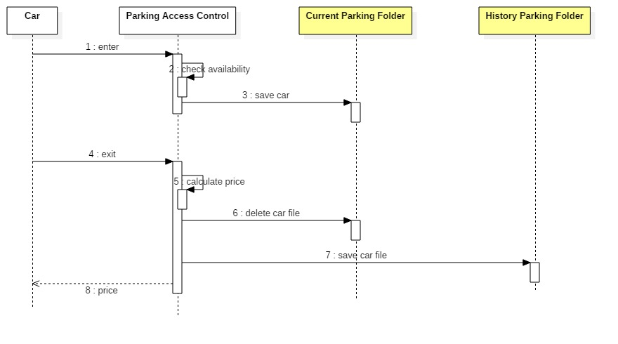
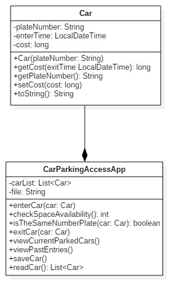

# Lab 8 - Car Parking Access Controll System

## Exercise 1 

Implement a car access parking system. 

### Functional requirements

**Enter Car Park**
- car is identified by plate number
- if there are free parking spaces car is allowed to enter if not the car access is denied
- access is denied if a car with the same plate umber is already parked

**Check Space Available**
- parking has a limited number of places available (configurable through the app)
- if number of spaces available is 0 car is denied access

**Exit Car Park**
- when leaving total stay cost is calculated 
- after leaving an access log for that car and period is stored for reporting purpose

**Calculare Usage Cost**
- cost of parking is calculated in increments of 1 SECOND to make it more easy to tests the system 
- 1 SECOND costs 1 RON

**View Current Parked Cars**
- display all cars currently parked. Display : plate number, entry time, current cost
- display available free spaces 

**View All Past Entries for a Car**
- display all past entries for a car. Display: plate number, entry time, total stay (in seconds), total cost;
- display total cost for all stays

**View All Unique Past Entries**
- display all unique cars eneterd in parking lot in the past. Display: plat number and number of entries for each car 

### Non-functional requirements (technical constraints)

1. Car access details will be stored in a persistant storage on disk as files and the state is not lost when the application is restarted. 
2. Car access details cab be stored using one of the 2 Java mechanisms: JSON obejcts, Serialization. 
3. Minimal unit-tests should be provided to demonstrate the correct behaviour of the system.

## Exercise 2 

